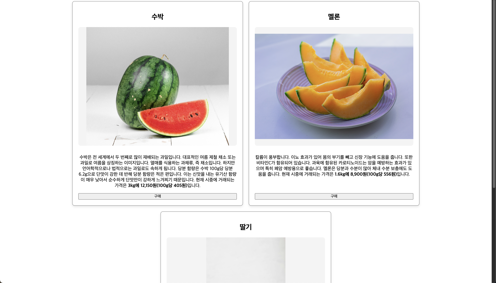

# 🧃 Product Card UI

상품 카드 형태의 UI를 HTML + CSS로 구현한 미니 프로젝트입니다.

## 📌 기능
- 상품 이미지, 이름, 설명, 가격, 구매 버튼
- 반응형 레이아웃 (모바일/태블릿/PC)
- 마우스 hover 애니메이션

## 📂 기술 스택
- HTML5
- CSS3 (Flexbox 또는 Grid)

## 📷 미리보기

## 🚀 실행 방법
1. 이 저장소를 클론하세요
2. `index.html` 파일을 브라우저로 열면 됩니다

## 🙌 만든 사람
김용진 - 프론트엔드 학습 중
